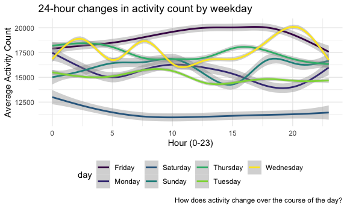

Homework 3
================
Rachel Tao

``` r
library(tidyverse)
```

    ## ── Attaching packages ──────────────────────────────────────────────────────────────── tidyverse 1.3.0 ──

    ## ✓ ggplot2 3.3.2     ✓ purrr   0.3.4
    ## ✓ tibble  3.0.3     ✓ dplyr   1.0.2
    ## ✓ tidyr   1.1.2     ✓ stringr 1.4.0
    ## ✓ readr   1.3.1     ✓ forcats 0.5.0

    ## ── Conflicts ─────────────────────────────────────────────────────────────────── tidyverse_conflicts() ──
    ## x dplyr::filter() masks stats::filter()
    ## x dplyr::lag()    masks stats::lag()

``` r
library(p8105.datasets)

knitr::opts_chunk$set(
  fig.width = 6,
  fig.asp = 0.6,
  out.width = "90%"
)

theme_set(theme_minimal() + theme(legend.position = "bottom"))

options(
  ggplot2.continuous.colour = "viridis",
  ggplot2.continuous.fill = "viridis"
)

scale_colour_discrete = scale_colour_viridis_d
scale_fill_discrete = scale_fill_viridis_d
```

# Problem 1

``` r
data("instacart")
```

This dataset contains 1384617 and 15 columns.

Observations are the level of items in orders by user. There are user /
order variables – user ID, order ID, order day, and order hour. There
are also item variables – name, aisle, department, and some numeric
codes. Make sure to convey structure of the data.

How many aisles, and which are most items from?

``` r
instacart %>% 
  count(aisle) %>% 
  arrange(desc(n))
```

    ## # A tibble: 134 x 2
    ##    aisle                              n
    ##    <chr>                          <int>
    ##  1 fresh vegetables              150609
    ##  2 fresh fruits                  150473
    ##  3 packaged vegetables fruits     78493
    ##  4 yogurt                         55240
    ##  5 packaged cheese                41699
    ##  6 water seltzer sparkling water  36617
    ##  7 milk                           32644
    ##  8 chips pretzels                 31269
    ##  9 soy lactosefree                26240
    ## 10 bread                          23635
    ## # … with 124 more rows

134 aisles, most come from fresh vegetables and fresh fruits.

Let’s make a plot

``` r
instacart %>% 
  count(aisle) %>% 
  filter(n > 10000) %>%
  mutate(
    aisle = factor(aisle),
    aisle = fct_reorder(aisle, n)
  ) %>% 
  ggplot(aes(x = aisle, y = n)) +
  geom_point() +
  theme(axis.text.x = element_text(angle = 90, vjust = 0.5, hjust = 1))
```

Let’s make a table

``` r
instacart %>% 
  filter(aisle %in% c("baking ingredients", "dog food care", "packaged vegetables fruits")) %>% 
  group_by(aisle) %>% 
  count(product_name) %>% 
  mutate(rank = min_rank(desc(n))) %>% 
  filter(rank < 4) %>% 
  arrange(aisle, rank) %>% 
  knitr::kable()
```

| aisle                      | product\_name                                 |    n | rank |
| :------------------------- | :-------------------------------------------- | ---: | ---: |
| baking ingredients         | Light Brown Sugar                             |  499 |    1 |
| baking ingredients         | Pure Baking Soda                              |  387 |    2 |
| baking ingredients         | Cane Sugar                                    |  336 |    3 |
| dog food care              | Snack Sticks Chicken & Rice Recipe Dog Treats |   30 |    1 |
| dog food care              | Organix Chicken & Brown Rice Recipe           |   28 |    2 |
| dog food care              | Small Dog Biscuits                            |   26 |    3 |
| packaged vegetables fruits | Organic Baby Spinach                          | 9784 |    1 |
| packaged vegetables fruits | Organic Raspberries                           | 5546 |    2 |
| packaged vegetables fruits | Organic Blueberries                           | 4966 |    3 |

Apples vs. ice cream

``` r
instacart %>% 
  filter(product_name %in% c("Pink Lady Apples", "Coffee Ice Cream")) %>% 
  group_by(product_name, order_dow) %>% 
  summarize(mean_hour = mean(order_hour_of_day)) %>% 
  pivot_wider(
    names_from = order_dow,
    values_from = mean_hour
  )
```

    ## `summarise()` regrouping output by 'product_name' (override with `.groups` argument)

    ## # A tibble: 2 x 8
    ## # Groups:   product_name [2]
    ##   product_name       `0`   `1`   `2`   `3`   `4`   `5`   `6`
    ##   <chr>            <dbl> <dbl> <dbl> <dbl> <dbl> <dbl> <dbl>
    ## 1 Coffee Ice Cream  13.8  14.3  15.4  15.3  15.2  12.3  13.8
    ## 2 Pink Lady Apples  13.4  11.4  11.7  14.2  11.6  12.8  11.9

## Problem 2

Read in and tidy accel\_data.csv

``` r
accel <- read_csv("./data/accel_data.csv") %>%
  pivot_longer(
    activity.1:activity.1440,
    names_to = "min",
    names_prefix = "activity.",
    values_to = "activity_count"
  )
```

    ## Parsed with column specification:
    ## cols(
    ##   .default = col_double(),
    ##   day = col_character()
    ## )

    ## See spec(...) for full column specifications.

``` r
week_df <- 
  tibble(
    weekday = c(1,2,3,4,5,6,7),
    day = c("Monday", "Tuesday", "Wednesday", "Thursday", "Friday", "Saturday", "Sunday")
  )

accel <- 
  left_join(accel, week_df, by = "day") %>% 
  arrange(week, weekday, .by_group = TRUE) %>% 
  mutate(
    day_type = 
      as.factor(ifelse(day %in% c("Saturday", "Sunday"), "weekend", "weekday")),
    day = 
      as.factor(day),
    min =
      as.integer(min),
    hour = 
      min %% 24,
    week =
      as.factor(week)
  ) %>% 
  relocate(day_id, week, day, day_type, hour, min) %>% 
  select(-weekday)
```

Describe the dataset above.

Aggregate minutes to days

``` r
accel %>% 
  group_by(week, day) %>% 
  summarize(activity_count_day = sum(activity_count)) %>% 
  arrange(week, day) %>% 
  knitr::kable(digits = 1)
```

    ## `summarise()` regrouping output by 'week' (override with `.groups` argument)

| week | day       | activity\_count\_day |
| :--- | :-------- | -------------------: |
| 1    | Friday    |             480542.6 |
| 1    | Monday    |              78828.1 |
| 1    | Saturday  |             376254.0 |
| 1    | Sunday    |             631105.0 |
| 1    | Thursday  |             355923.6 |
| 1    | Tuesday   |             307094.2 |
| 1    | Wednesday |             340115.0 |
| 2    | Friday    |             568839.0 |
| 2    | Monday    |             295431.0 |
| 2    | Saturday  |             607175.0 |
| 2    | Sunday    |             422018.0 |
| 2    | Thursday  |             474048.0 |
| 2    | Tuesday   |             423245.0 |
| 2    | Wednesday |             440962.0 |
| 3    | Friday    |             467420.0 |
| 3    | Monday    |             685910.0 |
| 3    | Saturday  |             382928.0 |
| 3    | Sunday    |             467052.0 |
| 3    | Thursday  |             371230.0 |
| 3    | Tuesday   |             381507.0 |
| 3    | Wednesday |             468869.0 |
| 4    | Friday    |             154049.0 |
| 4    | Monday    |             409450.0 |
| 4    | Saturday  |               1440.0 |
| 4    | Sunday    |             260617.0 |
| 4    | Thursday  |             340291.0 |
| 4    | Tuesday   |             319568.0 |
| 4    | Wednesday |             434460.0 |
| 5    | Friday    |             620860.0 |
| 5    | Monday    |             389080.0 |
| 5    | Saturday  |               1440.0 |
| 5    | Sunday    |             138421.0 |
| 5    | Thursday  |             549658.0 |
| 5    | Tuesday   |             367824.0 |
| 5    | Wednesday |             445366.0 |

``` r
#why isn't this table in correct weekday order?
```

Trends?

Create a plot showing how activity count changes over the course of the
dayfor each day of the week.

``` r
accel %>% 
  group_by(week, day, hour) %>% 
  mutate(
    activity_count_hour = 
      sum(activity_count)
  ) %>% 
  ggplot(aes(x = hour, y = activity_count_hour, color = day)) +
  geom_smooth()
```

    ## `geom_smooth()` using method = 'gam' and formula 'y ~ s(x, bs = "cs")'



``` r
#why are the weekdays in a weird order still?
#format labels to be a little nicer
```

# Problem 3

``` r
data("ny_noaa")
```

``` r
ny_noaa %>% 
  separate(date, into = c("year", "month", "day"), sep = ) %>% 
  mutate(
    year =
      as.numeric(year),
    month =
      as.numeric(month),
    day = 
      as.numeric(day),
    prcp =
      10*prcp,
    tmax =
      10*(as.numeric(tmax)),
    tmin =
      10*(as.numeric(tmin))
  )
```

    ## # A tibble: 2,595,176 x 9
    ##    id           year month   day  prcp  snow  snwd  tmax  tmin
    ##    <chr>       <dbl> <dbl> <dbl> <dbl> <int> <int> <dbl> <dbl>
    ##  1 US1NYAB0001  2007    11     1    NA    NA    NA    NA    NA
    ##  2 US1NYAB0001  2007    11     2    NA    NA    NA    NA    NA
    ##  3 US1NYAB0001  2007    11     3    NA    NA    NA    NA    NA
    ##  4 US1NYAB0001  2007    11     4    NA    NA    NA    NA    NA
    ##  5 US1NYAB0001  2007    11     5    NA    NA    NA    NA    NA
    ##  6 US1NYAB0001  2007    11     6    NA    NA    NA    NA    NA
    ##  7 US1NYAB0001  2007    11     7    NA    NA    NA    NA    NA
    ##  8 US1NYAB0001  2007    11     8    NA    NA    NA    NA    NA
    ##  9 US1NYAB0001  2007    11     9    NA    NA    NA    NA    NA
    ## 10 US1NYAB0001  2007    11    10    NA    NA    NA    NA    NA
    ## # … with 2,595,166 more rows

``` r
#how best to assess missingness?
```

Snow

``` r
ny_noaa %>% 
  count(snow) %>% 
  arrange(-n)
```

    ## # A tibble: 282 x 2
    ##     snow       n
    ##    <int>   <int>
    ##  1     0 2008508
    ##  2    NA  381221
    ##  3    25   31022
    ##  4    13   23095
    ##  5    51   18274
    ##  6    76   10173
    ##  7     8    9962
    ##  8     5    9748
    ##  9    38    9197
    ## 10     3    8790
    ## # … with 272 more rows

The most commonly observed values are 0 and NA. This is because for most
days of the year, there is not snow.
