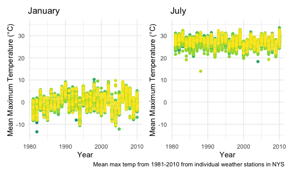
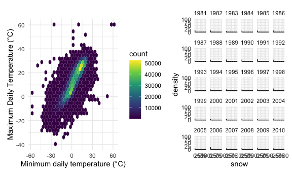

Homework 3
================
Rachel Tao

``` r
library(tidyverse)
```

    ## ── Attaching packages ───────────────────────────────────────────────────────────────── tidyverse 1.3.0 ──

    ## ✓ ggplot2 3.3.2     ✓ purrr   0.3.4
    ## ✓ tibble  3.0.3     ✓ dplyr   1.0.2
    ## ✓ tidyr   1.1.2     ✓ stringr 1.4.0
    ## ✓ readr   1.3.1     ✓ forcats 0.5.0

    ## ── Conflicts ──────────────────────────────────────────────────────────────────── tidyverse_conflicts() ──
    ## x dplyr::filter() masks stats::filter()
    ## x dplyr::lag()    masks stats::lag()

``` r
library(p8105.datasets)
library(patchwork)

knitr::opts_chunk$set(
  fig.width = 6,
  fig.asp = 0.6,
  out.width = "90%"
)

theme_set(theme_minimal() + theme(legend.position = "bottom"))

options(
  ggplot2.continuous.colour = "viridis",
  ggplot2.continuous.fill = "viridis"
)

scale_colour_discrete = scale_colour_viridis_d
scale_fill_discrete = scale_fill_viridis_d
```

# Problem 1

``` r
data("instacart")
```

This dataset contains 1384617 and 15 columns.

Observations are the level of items in orders by user. There are user /
order variables – user ID, order ID, order day, and order hour. There
are also item variables – name, aisle, department, and some numeric
codes. Make sure to convey structure of the data.

How many aisles, and which are most items from?

``` r
instacart %>% 
  count(aisle) %>% 
  arrange(desc(n))
```

    ## # A tibble: 134 x 2
    ##    aisle                              n
    ##    <chr>                          <int>
    ##  1 fresh vegetables              150609
    ##  2 fresh fruits                  150473
    ##  3 packaged vegetables fruits     78493
    ##  4 yogurt                         55240
    ##  5 packaged cheese                41699
    ##  6 water seltzer sparkling water  36617
    ##  7 milk                           32644
    ##  8 chips pretzels                 31269
    ##  9 soy lactosefree                26240
    ## 10 bread                          23635
    ## # … with 124 more rows

134 aisles, most come from fresh vegetables and fresh fruits.

Let’s make a plot

``` r
instacart %>% 
  count(aisle) %>% 
  filter(n > 10000) %>%
  mutate(
    aisle = factor(aisle),
    aisle = fct_reorder(aisle, n)
  ) %>% 
  ggplot(aes(x = aisle, y = n)) +
  geom_point() +
  theme(axis.text.x = element_text(angle = 90, vjust = 0.5, hjust = 1))
```

Let’s make a table

``` r
instacart %>% 
  filter(aisle %in% c("baking ingredients", "dog food care", "packaged vegetables fruits")) %>% 
  group_by(aisle) %>% 
  count(product_name) %>% 
  mutate(rank = min_rank(desc(n))) %>% 
  filter(rank < 4) %>% 
  arrange(aisle, rank) %>% 
  knitr::kable()
```

| aisle                      | product\_name                                 |    n | rank |
| :------------------------- | :-------------------------------------------- | ---: | ---: |
| baking ingredients         | Light Brown Sugar                             |  499 |    1 |
| baking ingredients         | Pure Baking Soda                              |  387 |    2 |
| baking ingredients         | Cane Sugar                                    |  336 |    3 |
| dog food care              | Snack Sticks Chicken & Rice Recipe Dog Treats |   30 |    1 |
| dog food care              | Organix Chicken & Brown Rice Recipe           |   28 |    2 |
| dog food care              | Small Dog Biscuits                            |   26 |    3 |
| packaged vegetables fruits | Organic Baby Spinach                          | 9784 |    1 |
| packaged vegetables fruits | Organic Raspberries                           | 5546 |    2 |
| packaged vegetables fruits | Organic Blueberries                           | 4966 |    3 |

Apples vs. ice cream

``` r
instacart %>% 
  filter(product_name %in% c("Pink Lady Apples", "Coffee Ice Cream")) %>% 
  group_by(product_name, order_dow) %>% 
  summarize(mean_hour = mean(order_hour_of_day)) %>% 
  pivot_wider(
    names_from = order_dow,
    values_from = mean_hour
  )
```

    ## `summarise()` regrouping output by 'product_name' (override with `.groups` argument)

    ## # A tibble: 2 x 8
    ## # Groups:   product_name [2]
    ##   product_name       `0`   `1`   `2`   `3`   `4`   `5`   `6`
    ##   <chr>            <dbl> <dbl> <dbl> <dbl> <dbl> <dbl> <dbl>
    ## 1 Coffee Ice Cream  13.8  14.3  15.4  15.3  15.2  12.3  13.8
    ## 2 Pink Lady Apples  13.4  11.4  11.7  14.2  11.6  12.8  11.9

## Problem 2

Read in and tidy accel\_data.csv

``` r
accel <- read_csv("./data/accel_data.csv") %>%
  pivot_longer(
    activity.1:activity.1440,
    names_to = "min",
    names_prefix = "activity.",
    values_to = "activity_count"
  )
```

    ## Parsed with column specification:
    ## cols(
    ##   .default = col_double(),
    ##   day = col_character()
    ## )

    ## See spec(...) for full column specifications.

``` r
week_df <- 
  tibble(
    weekday = c(1,2,3,4,5,6,7),
    day = c("Monday", "Tuesday", "Wednesday", "Thursday", "Friday", "Saturday", "Sunday")
  )

accel <- 
  left_join(accel, week_df, by = "day") %>% 
  arrange(week, weekday, .by_group = TRUE) %>% 
  mutate(
    day_type = 
      as.factor(ifelse(day %in% c("Saturday", "Sunday"), "weekend", "weekday")),
    day = 
      as.factor(day),
    min =
      as.integer(min),
    hour = 
      min %% 24,
    week =
      as.factor(week)
  ) %>% 
  relocate(day_id, week, day, day_type, hour, min) %>% 
  select(-weekday)
```

The accel dataset has accelerometer data collected on a 63 year-old male
with BMI 25, who was admitted to the Advanced Cardiac CareCenter of
CUIMC, and diagnosed with congestive heart failure. The original dataset
showed activity counts for each minute of the day, as measured by the
accelerometer. The cleaned dataset has 50400 rows and 7 columns, and
variables include day\_id, week, day, day\_type, hour, min, and
activity\_count. ‘day\_id’ is a unique identifier for each day in the
dataset. ‘week’ shows the week of observation, from weeks 1-5. ‘day’
indicates the day of the week of the observation (Mon-Sun), and
‘day\_type’ indicates if the day was a weekday or a weekend. ‘hour’
includes the hour of the 24-hour day (0-23), and ‘min’ is the minute of
the day (1-1440). ‘activity\_count’ is the activity count measured by
the accelerometer for each minute of the day.

Aggregate minutes to days

``` r
accel %>% 
  group_by(week, day) %>% 
  summarize(activity_count_day = sum(activity_count)) %>% 
  arrange(activity_count_day) %>% 
  knitr::kable(digits = 1)
```

    ## `summarise()` regrouping output by 'week' (override with `.groups` argument)

| week | day       | activity\_count\_day |
| :--- | :-------- | -------------------: |
| 4    | Saturday  |               1440.0 |
| 5    | Saturday  |               1440.0 |
| 1    | Monday    |              78828.1 |
| 5    | Sunday    |             138421.0 |
| 4    | Friday    |             154049.0 |
| 4    | Sunday    |             260617.0 |
| 2    | Monday    |             295431.0 |
| 1    | Tuesday   |             307094.2 |
| 4    | Tuesday   |             319568.0 |
| 1    | Wednesday |             340115.0 |
| 4    | Thursday  |             340291.0 |
| 1    | Thursday  |             355923.6 |
| 5    | Tuesday   |             367824.0 |
| 3    | Thursday  |             371230.0 |
| 1    | Saturday  |             376254.0 |
| 3    | Tuesday   |             381507.0 |
| 3    | Saturday  |             382928.0 |
| 5    | Monday    |             389080.0 |
| 4    | Monday    |             409450.0 |
| 2    | Sunday    |             422018.0 |
| 2    | Tuesday   |             423245.0 |
| 4    | Wednesday |             434460.0 |
| 2    | Wednesday |             440962.0 |
| 5    | Wednesday |             445366.0 |
| 3    | Sunday    |             467052.0 |
| 3    | Friday    |             467420.0 |
| 3    | Wednesday |             468869.0 |
| 2    | Thursday  |             474048.0 |
| 1    | Friday    |             480542.6 |
| 5    | Thursday  |             549658.0 |
| 2    | Friday    |             568839.0 |
| 2    | Saturday  |             607175.0 |
| 5    | Friday    |             620860.0 |
| 1    | Sunday    |             631105.0 |
| 3    | Monday    |             685910.0 |

I can see some interesting trends by ordering the table summarizing
activity count by day by activity count. NSome notable outliers are
Saturday of weeks 4 and 5, where the activity count was only 1440. Since
there are 1440 minutes in a day, and it seems the lowest value of of
activity\_count per minute, this could be of some concern, as it
indicates extremely low activity. One plausible explanation could be
accelerometer malfunction - perhaps it was not properly reading the
patient’s activity on those days, or was disconnected somehow. Fridays
seem to be relatively high-activity days.

Create a plot showing how activity count changes over the course of the
day for each day of the week.

``` r
accel %>% 
  group_by(week, day, hour) %>% 
  mutate(
    activity_count_hour = 
      sum(activity_count)
  ) %>% 
  ggplot(aes(x = hour, y = activity_count_hour, color = day)) +
  geom_smooth() +
  labs(
    title = "24-hour changes in activity count by weekday",
    x = "Hour (0-23)",
    y = "Average Activity Count",
    caption = "How does activity change over the course of the day?"
  ) 
```

    ## `geom_smooth()` using method = 'gam' and formula 'y ~ s(x, bs = "cs")'


From this plot it looks like Saturdays have the lowest average activity
counts, and Fridays have the highest, overall. On Saturdays there is a
slope downward from midnight to 5am, and a plateau after around 7am. On
Fridays there is a steady increase in activity from midnight to 10am, a
plateau from 10am to 5pm, and a decrease in activity from 5pm to
midnight. For all other days of the week, activity is variable throught
the day, with the greatest amplitude in variability on Wednesdays.

# Problem 3

``` r
data("ny_noaa")
```

``` r
ny_noaa <- 
  separate(ny_noaa, date, into = c("year", "month", "day"), sep = ) %>% 
  mutate(
    year =
      as.numeric(year),
    month =
      as.numeric(month),
    day = 
      as.numeric(day),
    prcp =
      0.001*prcp,
    tmax =
      0.1*(as.numeric(tmax)),
    tmin =
      0.1*(as.numeric(tmin)),
    snow =
      0.01*(snow),
    snwd = 
      0.01*(snwd)
  )
```

This dataset has climate information from all NY state weather stations
from January 1, 1981 through December 31, 2010. The ny\_noaa dataset has
2595176 rows and 9 columns. The column names in the dataset include
‘id’, ‘year’, ‘month’, ‘day’, ‘prcp’, ‘snow’, ‘snwd’, ‘tmax’, and
‘tmin’. ‘id’ includes the id number of the weather station. ‘year’,
‘month’, and ‘day’, all show the date informaton for each observation.
‘prcp’ is the daily precipitation in cm. ‘snow’ is the daily snowfall in
cm. ‘snwd’ is the daily snow depth in cm. ‘tmax’ is the daily maximum
temperature in ªC and ‘tmin’ is the daily minimum temperature in °C.
There are many missing values because each weather station may only
collect a subset of the variables included in the full dataset.

What are the most commonly observed values for snowfall?

``` r
ny_noaa %>% 
  count(snow) %>% 
  arrange(-n)
```

    ## # A tibble: 282 x 2
    ##     snow       n
    ##    <dbl>   <int>
    ##  1  0    2008508
    ##  2 NA     381221
    ##  3  0.25   31022
    ##  4  0.13   23095
    ##  5  0.51   18274
    ##  6  0.76   10173
    ##  7  0.08    9962
    ##  8  0.05    9748
    ##  9  0.38    9197
    ## 10  0.03    8790
    ## # … with 272 more rows

The most commonly observed values are 0 and NA. It makes sense that the
most common value is 0, because for most days of the year, there is not
snow. It also makes sense that the second most common value is ‘NA’
because, as stated above, there is a fair amount of missingness in this
dataset due to differences in which weather variables each weather
station collects data on.

Make a two-panel plot of the average max temp in July and January in
each station across years.

``` r
jan <- 
  ny_noaa %>% 
  filter(month == 1) %>% 
  group_by(id, year, month) %>% 
  summarize(mean_tmax = mean(tmax, na.rm = TRUE)) %>% 
  ggplot(aes(x = year, y = mean_tmax, group = id, color = id)) +
  geom_point() +
  theme(legend.position = "none") +
  ylim(-15, 35) +
  labs(
    title = "January",
    x = "Year",
    y = "Mean Maximum Temperature (°C)"
  ) 
```

    ## `summarise()` regrouping output by 'id', 'year' (override with `.groups` argument)

``` r
july <- 
  ny_noaa %>% 
  filter(month == 7) %>% 
  group_by(id, year, month) %>% 
  summarize(mean_tmax = mean(tmax, na.rm = TRUE)) %>% 
  ggplot(aes(x = year, y = mean_tmax, group = id, color = id)) +
  geom_point() +
  theme(legend.position = "none") +
  ylim(-15, 35) +
  labs(
    title = "July",
    x = "Year",
    y = "Mean Maximum Temperature (°C)",
    caption = "Mean max temp from 1981-2010 from individual weather stations in NYS"
    ) 
```

    ## `summarise()` regrouping output by 'id', 'year' (override with `.groups` argument)

``` r
jan + july
```

    ## Warning: Removed 2923 rows containing missing values (geom_point).

    ## Warning: Removed 3047 rows containing missing values (geom_point).



The mean max temp appears more variable in January than in July. There
do appear to be certain years that have colder winters than others, and
certain years that have warmer summers than others, overall (each year
seems to have its own distribution of mean max daily temperatures). In
January in the early 1980’s there are a couple low outliers. There is
also one low outlier in July in the late 1980’s, which appears to show a
mean maximum temperature of around 14°C, when the majority of the
weather stations have mean maximum temperatures between 29 and 32°C.

Make a two-panel plot of tmax vs. tmn for the full dataset.

``` r
tmin_tmax_p <- 
  ny_noaa %>% 
  ggplot(aes(x = tmin, y = tmax, na.rm = TRUE)) +
  geom_hex() +
  theme(legend.position = "right") +
  labs(
    x = "Minimum daily temperature (°C)",
    y = "Maximum Daily Temperature (°C)"
  ) 

snow_dist_p <- 
  ny_noaa %>% 
  ggplot(aes(x = snow)) +
  geom_density() +
  ylim(0,100) +
  facet_grid(.~year,) +
  facet_wrap(vars(year))

tmin_tmax_p + snow_dist_p
```

    ## Warning: Removed 1136276 rows containing non-finite values (stat_binhex).

    ## Warning: Removed 381221 rows containing non-finite values (stat_density).


